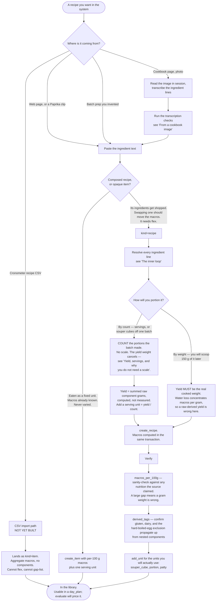
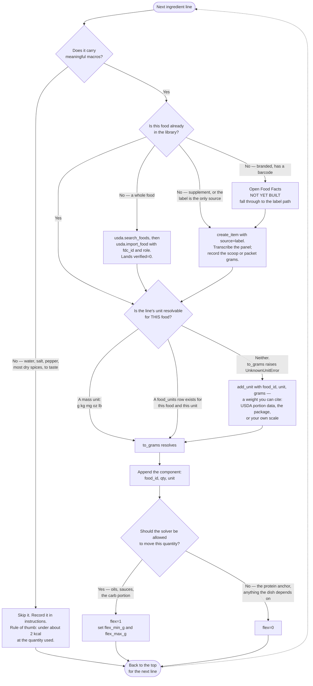

# Importing a recipe

How a recipe — from a cookbook photo, a web page, a Paprika clip, or your own head —
becomes a row in `foods` with trustworthy per-100 g macros.

This is a **runbook for a session activity, not a code path.** Spec §6 is explicit that
matching ingredient lines to foods is judgment work done in session against the library's
callable surface. No scraper or importer is built for it. What follows is the shape of that
work, and where the system will stop you if you skip a step.

---

## The spine



### Yield, servings, and why you do not need a scale

The spec presents `cooked_yield_g` as a weighing step. **For count-portioned recipes that is
wrong, and the arithmetic proves it.**

Let `M` be the recipe's total macros, summed from its components — known entirely from the
inputs, no measurement involved. Let `Y` be whatever number goes in `cooked_yield_g`, and let
the recipe make `n` portions.

```
stored per-100 g   =  M × 100 / Y
serving unit grams =  Y / n
one serving        =  (M × 100 / Y) × (Y / n) / 100  =  M / n
```

**`Y` cancels.** Any self-consistent value produces exactly the right macros per serving —
the same cancellation §9 already documents for the golden-file fixture. So set `Y` to the
summed raw component grams, which the library can compute for free, add a `serving` unit of
`Y / n`, and never touch a scale.

The one number you must capture in the kitchen is **`n`: how many portions the batch made.**
That is a count, not a weighing — count the souper cubes the batch filled. Batch-to-batch
variation in water loss does not matter, because it never enters the arithmetic.

**When `Y` stops cancelling** — and the only case where a scale is genuinely required:

- You portion **by weight** rather than by count: scooping 150 g of chili, or filling
  containers to a target weight. Then `Y` must be the real cooked weight, because water loss
  concentrates macros per gram and a raw-derived `Y` will understate them, sometimes badly.
- The recipe is **nested into a parent recipe by weight** rather than by serving. Same reason.

A recipe with a raw-derived `Y` therefore has a **nominal `kcal_100g`, not a real one.** It
is correct per serving and wrong per gram. `foods.yield_basis` records which it is —
`'raw_derived'` or `'measured'` — so the two never get confused.

In code:

- `create_recipe(..., servings=n)` — the normal path. Derives the yield, adds the `serving`
  unit, marks the basis `raw_derived`. Passing `servings` together with `cooked_yield_g`, or
  with an explicit `units={"serving": ...}`, is rejected: each is two sources for one number,
  and silently picking one produces a recipe whose servings do not add up to the batch.
- `create_recipe(..., cooked_yield_g=g)` — when the dish was weighed. Basis `measured`.
- `set_cooked_yield(conn, food_id, g)` — the create-now, cook-later path. Compose the recipe
  with no yield, cook it, then record the weight; macros are computed on the spot and the
  basis is set to `measured`.

### The gate that stands

- **Per-food unit conversions.** `to_grams` raises `UnknownUnitError` rather than assuming a
  default, because a tablespoon of oil is not a tablespoon of mayo and a scoop of Karbolyn is
  not a scoop of cyclic dextrin. Most of these can be filled from USDA automatically — see
  below.

---

## The inner loop

Run this once per ingredient line.



Nothing here writes a partial row. `create_item` and `create_recipe` each wrap the food, its
components, and its units in one transaction, so a rejected component never leaves an empty
recipe behind.

---

## From a cookbook image

Cookbook photos are the **worst-case input** for this system, and it is worth being explicit
about why: cookbooks are written in countable and volumetric units, and this system runs on
grams. Most of the work is manufacturing gram weights the page does not contain.

### Transcription checks

Run these before composing anything. Each is a failure that produces a plausible wrong number
rather than an error.

| Hazard | Why it bites | What to do |
|---|---|---|
| **Facing-page continuation** | Ingredient lists split across a page turn. A dropped line silently lowers every macro, and nothing detects it. | Photograph both pages. Count ingredient lines against the ones named in the directions. |
| **Prep-state ambiguity** | "1 cup walnuts, chopped" means measure whole, then chop. "1 cup chopped walnuts" means chop, then measure. These differ substantially by weight. | Weigh it. Do not try to convert between them. |
| **Countable units** | "1 medium onion", "2 cloves garlic" carry no gram weight, so `to_grams` raises. | Mostly solved — USDA ships these weights. See below. |
| **Volume for solids** | A cup of one solid tells you nothing about a cup of another. `food_units` is keyed per-food for exactly this reason. | Never reuse another food's cup weight. |
| **Missing yield** | Cookbooks say "serves 4", never "yields 1180 g". | Fine. "Serves 4" is the number you need — see the yield section. Correct it to the count the batch actually made. |
| **Raw vs cooked** | Cookbook quantities are raw. | Correct by construction — enter raw amounts. Do not pre-adjust for cooking loss. |
| **Units mixed** | US cookbooks give cups; European ones give grams. | Prefer grams-native sources when you have the choice. |
| **OCR digit errors** | Fractions and small decimals transcribe badly: `1½` against `11/2`, `0.5` against `05`. | Read the transcription back against the photo before composing. |

### Countable units: USDA already has the weights

USDA ships average gram weights for exactly these units, in the `foodPortions` array of a
food's detail payload. Verified against the live API:

| Food | Portions returned |
|---|---|
| Onions, raw (SR Legacy 170000) | medium (2-1/2" dia) **110 g**, large **150 g**, cup chopped **160 g**, cup sliced **115 g**, slice medium **14 g**, 10 rings **60 g**, tbsp chopped **10 g** |
| Garlic, raw (SR Legacy 169230) | clove **3 g**, 3 cloves **9 g**, tsp **2.8 g**, cup **136 g** |
| Carrots, raw (SR Legacy 170393) | medium **61 g**, small **50 g**, large **72 g**, cup grated **110 g**, cup chopped **128 g** |
| Chicken breast, raw (SR Legacy 171474) | breast, bone removed **145 g** |

So "1 medium onion" and "2 cloves garlic" resolve from the library, not from your scale.
Three caveats, all load-bearing:

- **Data type matters more than food quality here.** Foundation entries — the newer, better
  nutrient data — often carry only a single `RACC` row, a regulatory label serving. Garlic
  (Foundation 1104647) and celery (Foundation 2346405) both return one useless 85 g `RACC`
  portion. The *older* SR Legacy rows are the ones with real cooking units. Query SR Legacy
  specifically when you are after portions.
- **Divide `gramWeight` by `amount`.** The rows carry an amount: onion's is `amount=10,
  modifier="rings", gramWeight=60`, which is 6 g per ring, not 60. Reading `gramWeight`
  straight is the same class of error §6 warns about for the Cronometer columns.
- **Search relevance is poor and must not be trusted blindly.** Searching SR Legacy for
  "bell pepper" returns *TACO BELL, Nachos* as the top hit. Never take `foods[0]` without
  reading the description.

Coverage is good but not total — cilantro offers "sprigs 20 g" and "cup 4 g" but no "bunch".
For the genuine gaps, weigh once, `add_unit` it, and it is priced forever. That is the §10
principle: the library accumulates as a byproduct of work already being done. It is a
one-time cost per ingredient, not a per-recipe cost, and it does not happen mid-cook.

---

## What is not built yet

The flow above is honest about the current surface. Today it runs on `foods.create_item`,
`foods.add_unit`, `foods.create_recipe`, `foods.recompute_recipe`, `foods.derived_tags`, and
`sources.usda`. Gaps you will hit:

1. **Open Food Facts is not built.** Branded items fall through to manual label entry.
2. **The Cronometer CSV importer is not built.** Spec §6 resolved its format; the code is
   still pending.
3. **`fit()` is not built.** Placing a finished recipe into the right slot at the right
   quantity is manual until it is.
4. **No standing untagged-food check.** §8 promises one. Until it exists, tagging debt is
   invisible, and an untagged item silently fails to trip a protocol rule.
5. **No convention for zero-macro ingredients.** The "under about 2 kcal, skip it" rule above
   is a proposal, not something the schema or code enforces.
6. **`search_foods` still defaults to `("Foundation", "SR Legacy")`.** Fine for nutrients,
   but it means a portion-hungry lookup can land on the Foundation row that carries only a
   `RACC`. Passing `data_types=("SR Legacy",)` explicitly is the workaround.
7. **No migrations.** `schema.sql` carries `PRAGMA user_version`, but nothing reads it and
   `create_schema` uses bare `CREATE TABLE`, so it only works on an empty database. There is
   no upgrade route for a database created before a schema change — `db/migrations/` is in
   §3 of the spec but does not exist. Nothing is broken while no `.db` is tracked, but the
   first schema change made against a live database will need this built first.
8. **Some FDC ids returned by search 404 on the detail endpoint.** Seen live on fdcId 747447.
   Bulk seeding will need to tolerate it rather than abort.

**Not on this list: `find_food()`.** Looking up whether a food already exists is a one-line
`LIKE` against a few thousand rows. It is not a blocker and not a performance concern; a
helper would only standardize the return shape. The matching that is actually hard is on the
USDA side — picking the right entry out of a bad search ranking — and that is judgment work a
helper does not touch.

### Verified end to end

Against the live API, with no manual unit entry and no scale:

```
onion      (170000): medium (2-1/2" dia)=110g, large=150g, small=70g, cup, chopped=160g,
                     cup, sliced=115g, rings=6g, slice, thin=9g, tbsp chopped=10g, ...
garlic     (169230): clove=3g, cloves=3g, tsp=2.8g, cup=136g
red onion  (790577): Onion, Edible=197g

1 medium onion  -> 110.0 g
2 cloves garlic ->   6.0 g

create_recipe(servings=4) -> yield=143.0 g, basis=raw_derived
batch total 291.62 kcal ; one serving 72.90 kcal ; total/4 = 72.90
```

`rings=6g` (from `amount=10, gramWeight=60`) and `cloves=3g` (from `amount=3,
gramWeight=9`) are the divide-by-amount rule holding on real data. Red onion shows the
name-joining rule: FDC gives it as `measureUnit='Onion'` with `modifier='Edible'`, and taking
the modifier alone would have produced a unit called `Edible` with no way to ask for one
onion.

**Not on this list: `find_food()`.** Looking up whether a food already exists is a one-line
`LIKE` against a few thousand rows. It is not a blocker and not a performance concern; a
helper would only standardize the return shape. The matching that is actually hard is on the
USDA side — picking the right entry out of a bad search ranking — and that is judgment work a
helper does not touch.
